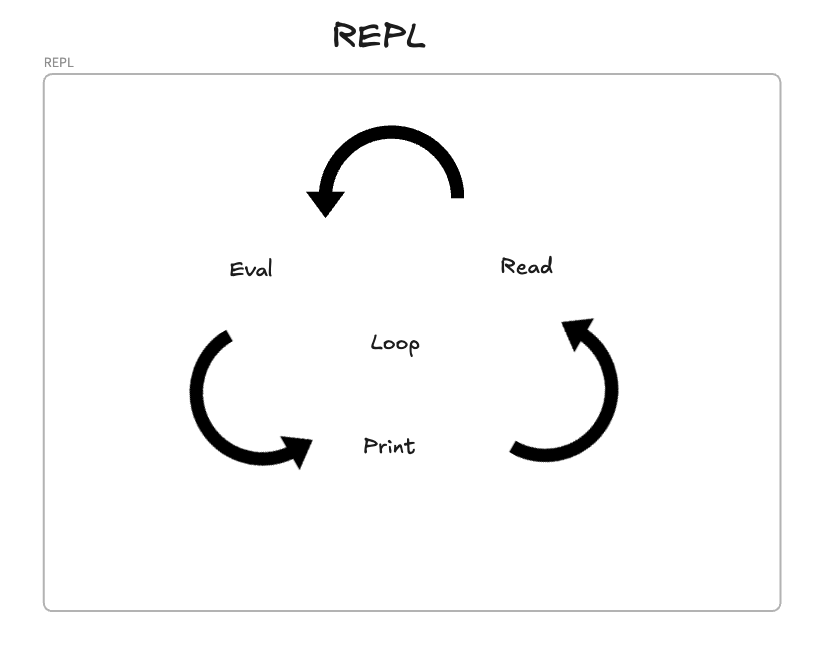
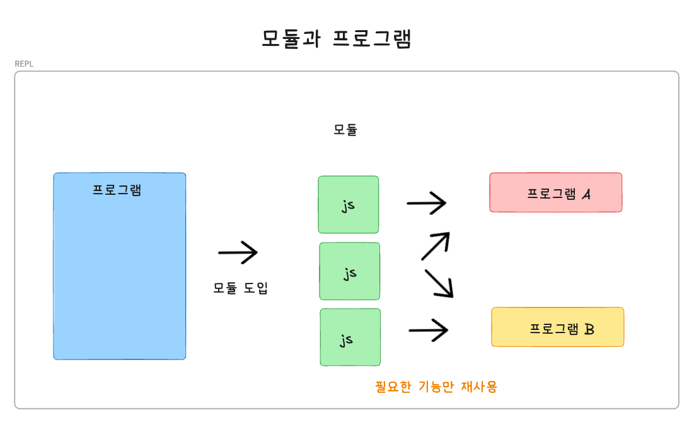
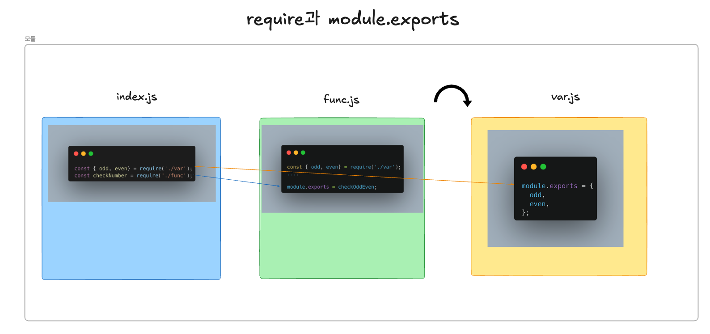

# 노드의 기본 기능

---

## 1. REPL 사용하기
JS는 스크립트 언어임으로 미리 컴파일하지 않아도 즉성에서 코드를 실행할 수 있음
- **입력한 코드를 읽고(Read), 해석하고(Eval), 결과 반환(Print), 종료될때까지 반복(Loop)한다고 해서 REPL(Read Eval Print Loop)라고 불림**



터미널에서 node 실행

-> 모양이되면 node에 접속해서 JS코드를 실행할 수 있음

```bash
$ node
> const str = 'Hello world, hello node';
undefined

> const log(str);
Hello world, hello node
undefined
```

REPL은 한 두줄짜리 코드를 테스트하는 용도로는 좋지만, 여러 줄의 코드를 실행하기에는 불편하여 거의 사용하지 않음
<br/>

## JS파일 실행하기

helloWorld.js
```JavaScript
const helloWorld = () => {
    console.log('Hello World');
    helloNode();
}

const helloNode = () => {
    console.log('Hello Node');
}

helloWorld();
```

출력 결과 확인
- node [자바스크립트 경로]를 실행하면 해당 결과가 출력됨
```bash
$ node helloWorld
Hello World
Hello Node
```

<br/>

## 모듈로 만들기

노드는 JS 코드를 모듈로 만들 수 있음
- 모듈: 특정한 기능을 하는 함수나 변수들의 집합
- 모듈로 만들면 여러 프로그램에서 재사용 가능



var.js
```JavaScript
const odd = '홀수입니다.';
const even = '짝수입니다.';

module.exports = {
    odd,
    even,
};
```

func.js
- ./require함수 안에 불러올 모듈의 경로를 적으며, 파일 경로에서 js나 json과 같은 확장자는 생략 가능
- module.exports에는 **객체만 대입하는 것이 아닌 함수나 변수를 대입가능**
- module.exports는 파일에서 단 1번만 사용이 가능함

```JavaScript
const { odd, even } = require('./var');

const checkOddOrEven = (num) => {
    return num % 2 ? return odd : return even;
}

module.exports = checkOddOrEven;
```

index.js
```JavaScript
const { odd, even } require('./var');
const checkNumber = require('./func');

const checkStringOddEven = (str) => {
    return str.length % 2 ? odd : even;
}

console.log(checkNumber(10));
console.log(checkStringOddOrEven('hello');
```



index.js 실행 결과
```bash
$ node index
짝수입니다.
홀수입니다.
```

### ES6의 모듈
- ES6에서 자체 모듈 시스템 문법이 등장함

**func.mjs**
- require과 module.export가 import, export default로 변경되었으며 노드 9버전부터 사용할 수 있음
- 파일의 확장자는 mjs로 지정해야 하며, package.json에 type:"module"속성을 넣어 사용함
```JavaScript
import { odd, even } from './var';

const checkOddOrEven = (num) => {
    return num % 2 ? odd : even; 
}

export default checkOddOrEven;
```
<br/>

- `module.exports`와 `exports`는 동일하며, 초기값은 빈 객체임.
- `exports`에도 함수를 추가할 수 있음. 단, `exports = 값`과 같이 재할당하면 참조가 끊어짐.
- `module.exports`는 파일에서 하나의 값을 내보낼 때 주로 사용되며,
  `exports`는 여러 값을 내보낼 때 속성을 추가하는 방식으로 사용됨.


**this**
노드에서 this를 사용할 때 주의점
- 최상위 스코프의 this는 module.exports, exports를 가리킴
- 그 외의 브라우저의 JS와 동일함
- 일반 함수 선언문 내부의 this는 global(전역) 객체를 가리킴
- 화살표 함수의 경우 this는 상위 스코프 exports 객체를 가리킴

this.js
- 
```JavaScript
console.log(this); //{}
console.log(this === module.exports); //true
console.log(this === exports); //true

//화살표 함수의 결과 true, false
const whatIsThis = () =>{
    console.log('function', this === exports, this === global);
} 

whatIsThis();
```

this.js
- 일반 함수 선언문 내부의 this는 global(전역) 객체를 가리킴
```javascript
console.log(this); //{}
console.log(this === module.exports); //true
console.log(this === exports); //true

//화살표 함수의 결과 false, true
function whatIsThis () {
    console.log('function', this === exports, this === global);
} 

whatIsThis();
```

**require모듈의 특성**
- require가 제일 위에 올 필요는 없음(import는 최상단에 위치해야 함)
- require.cache에 한번 require한 모듈에 대한 캐싱 정보가 들어 있음
- require모듈은 해당 경로에서 값을 가져옴
- require.main으로 어떤 파일을 실행할 것인지 알 수 있음

```javascript
console.log('require가 가장 위에 오지 않아도 됩니다.');

module.exports = '저를 찾아보세요.';

require('./var');

console.log('require.cache입니다.');
console.log(require.cache);
console.log('require.main입니다.');
console.log(require.main === module);
console.log(require.main.filename);
```
<br/>

### 순환참조
- 2개의 모듈이 서로를 require하는 상황을 조심해야 함
- Dep1이 dep2를 require하고, dep2가 dep1을 require함
- Dep1의 module.exports가 함수가 아닌 빈 객체여도 됨(무한 반복을 막기 위해 의도됨)
- 순환 참조하는 상황이 나오지 않도록 하는게 좋음

dep1.js
```javascript
const dep2 = require("./dep2");
console.log('require dep2',dep2);

module.exports = () => {
    console.log('dep2',dep2);
}
```


dep2.js
```javascript
const dep1 = require('./dep1');

console.log('require dep1', dep1);
module.exports = () => {
    console.log('dep1',dep1);
}
```

dep-run.js
```Javascript
const dep1 = require('./dep1');
const dep2 = require('./dep2');

dep1();
dep2();
```

실행 결과
```Bash
$ node dep-run
require dep1 {}
require dep2 [Function (anonymous)]
dep2 [Function (anonymous)]
dep1 {}
```

